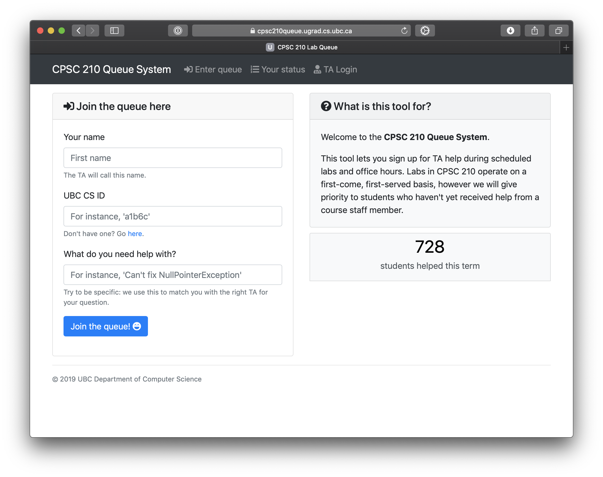

# CPSC 210 Queue System

[](https://codebeat.co/projects/github-com-agottardo-210-queue-system-master)



This application lets students taking CPSC 210 at UBC sign up for office hours via a convenient web interface. The app is
written in Go, and the web interface uses Bootstrap with some ugly JavaScript magic.

## I am a CPSC 210 student, what is this?

If you are a student you are in the wrong place: this website hosts the source code for the queue application. Go to https://cpsc210queue.ugrad.cs.ubc.ca to join the queue as a student.

## How to install and run the app

### Download and compile

Make sure you have [Go](http://golang.org/doc/install) installed. On a fresh Linux install, run:

```sh
$ go get -u github.com/agottardo/210-queue-system
$ cd $GOPATH/src/github.com/agottardo/210-queue-system
$ go build -o $GOPATH/bin/210-queue-system
```

You might need to fetch some dependencies using `go get -u`, followed by their respective Git URL. After following the instructions, you'll have created a binary inside `$GOPATH/bin`. 

### Settings and authentication details

In `$GOPATH/bin`, you'll have to create two JSON files:

#### `authdb.json`

This file contains the username and password for each TA:

```json
{
  "ta1": "ta1password",
  "ta2": "ta2password"
}
```

#### `config.json`
```json
{
  "MaxNumTimesHelped": 5,
  "AuthSecret": "FlfXgyRSwC2vPbLkaUP5"
}
```
`MaxNumTimesHelped` indicates how many times a student can get help over 24 hours, before they get rejected (see more info at the bottom).

`AuthSecret` is a random string used to hash passwords. Keep it *random*.

### Running

You're done! Run the binary at `$GOPATH/bin/210-queue-system` to start serving incoming HTTP requests. It might be a good idea to host the application behind a HTTPS proxy, in order to
comply with the UBC data protection regulations.

## What staff can do

TAs can use their credentials defined in `authdb.json` to perform the following operations:

### TA control panel

TAs can access the panel while offering office hours, and mark students as 'served'. It is important that TAs mark students as served right away, so that wait time estimates are accurate.

### JSON data dump

Instructors and TAs can download a dump of all the data contained in the database in JSON format. 
This can be useful for data analysis purposes during/after the term.

To do so, just go to `/jsondump` after logging in from the web interface.

### Maximum times helped

You can set a limit to the number of times a student can receive help over the range of 24 hours. Once this limit is reached, the student will read a message politely asking them to seek help elsewhere. You can set `MaxNumTimesHelped` to an insanely high number to disable this feature.